# 🚪 AbreLaPuerta

A secure, geo-verified gate opener for Home Assistant. Guests can open your gate from their phone using a PIN code — no app installation required. The system validates both the PIN and their physical proximity before triggering the gate.

  

---

## How it works



1. Guest opens the web app and enters the PIN
2. The browser requests GPS coordinates
3. The request goes to a Cloudflare Worker (PIN + coordinates)
4. The Worker forwards the request to Home Assistant via webhook
5. Home Assistant validates the PIN and calculates distance from home
6. HA calls back the Worker with the result (`granted` / `wrong_pin` / `too_far`)
7. The frontend receives the real result and shows the appropriate screen
8. If granted: a Shelly relay pulses to open the gate, then closes it after ~45s

---

## Features

- ✅ PIN + GPS proximity validation (configurable radius, default 50m)
- ✅ Real-time feedback — guests always know if PIN was wrong or they're too far
- ✅ Gate open/close animation in the UI
- ✅ GPS status indicator with one-tap permission request
- ✅ Cloudflare Worker proxy — Home Assistant URL never exposed to the client
- ✅ Durable Objects for reliable long-poll between frontend and HA callback
- ✅ Rate limiting (5 attempts per minute per IP)
- ✅ Callback secret verification
- ✅ WAF rules for country filtering and bot blocking
- ✅ Push notifications to owner's phone on every access attempt
- ✅ Optional: audio announcement via media player when gate opens

---

## Requirements

- [Home Assistant](https://www.home-assistant.io/) instance accessible from the internet
- [Cloudflare](https://cloudflare.com) account (free plan is sufficient)
- A domain managed by Cloudflare
- [Shelly 1 Mini](https://www.shelly.com/en/products/shop/shelly-1-mini-gen-3) (or any relay) connected to your gate motor
- [Node.js](https://nodejs.org) + [Wrangler CLI](https://developers.cloudflare.com/workers/wrangler/) for deploying the Worker
- A GitHub account (for Cloudflare Pages deployment)

---

## Project structure

```
/
├── index.html              # Main web app (PIN pad)
├── styles.css              # All styles
├── app.js                  # All frontend logic
├── favicon.png             # Site icon
├── robots.txt              # Disallow all crawlers
├── _headers                # Cloudflare Pages security headers
├── security.txt            # Vulnerability disclosure contact
├── functions/
│   └── api/
│       └── [[path]].js     # Cloudflare Pages Function (proxy to Worker)
├── worker.js               # Cloudflare Worker (main backend logic)
├── wrangler.toml           # Wrangler configuration
└── automation.yaml         # Home Assistant automation
```

---

## Setup guide

### 1. Home Assistant

#### 1a. Create the PIN helper

In HA go to **Settings → Devices & Services → Helpers → Create helper → Text**.

- Name: `guest_pin`
- Entity ID: `input_text.guest_pin`
- Set the value to your chosen PIN

#### 1b. Add the REST command

In your `configuration.yaml` (or a dedicated `rest_commands.yaml`):

```yaml
rest_command:
  worker_callback:
    url: "{{ callback_url }}"
    method: POST
    content_type: "application/json"
    payload: '{"secret":"{{ secret }}","request_id":"{{ request_id }}","status":"{{ status }}"}'
```

Reload HA after saving.

#### 1c. Import the automation

Go to **Settings → Automations → Import** and paste the contents of `automation.yaml`.

Update the following fields to match your setup:

| Field | Description |
|---|---|
| `webhook_id` | Generate a UUID at [uuidgenerator.net](https://uuidgenerator.net) |
| `lat_house` / `lon_house` | Your home coordinates |
| `radio_max` | Max allowed distance in meters (default: 50) |
| `shelly` | Your Shelly entity ID |
| `notify.mobile_app_*` | Your HA mobile app notification target |
| `media_player.*` | Your media player entity (optional) |
| `camera.*` | Your camera entity for notification image (optional) |

#### 1d. Expose HA to the internet

Use [Cloudflare Tunnel](https://developers.cloudflare.com/cloudflare-one/connections/connect-networks/) via the [Cloudflared](https://github.com/homeassistant-apps/app-cloudflared) HA add-on. Set your chosen subdomain as `external_hostname` in the add-on configuration.

Use a non-obvious subdomain (e.g. `something-random.yourdomain.com`) — avoid `ha.` or `homeassistant.`.

I recommend to add extra security measures to protect your HA subdomain. Explained on section 4.

---

### 2. Cloudflare Worker

#### 2a. Install Wrangler

```bash
npm install -g wrangler
wrangler login
```

#### 2b. Configure wrangler.toml

Edit `wrangler.toml` and set `name` to match your desired Worker name:

```toml
name = "your-worker-name"
main = "worker.js"
compatibility_date = "2024-01-01"

[[durable_objects.bindings]]
name       = "RESULT_WAITER"
class_name = "ResultWaiter"

[[migrations]]
tag                = "v1"
new_sqlite_classes = ["ResultWaiter"]
```

#### 2c. Set environment variables

In **Cloudflare Dashboard → Workers & Pages → your worker → Settings → Variables and Secrets**, add:

| Variable | Description |
|---|---|
| `HA_URL` | Your Home Assistant URL (e.g. `https://random.yourdomain.com`) |
| `WEBHOOK_ID` | The UUID you set in the automation |
| `CALLBACK_SECRET` | A random UUID — used to verify HA callbacks |
| `CF_CLIENT_ID` | Cloudflare Access Service Token Client ID (see step 4) |
| `CF_CLIENT_SECRET` | Cloudflare Access Service Token Client Secret (see step 4) |
| `WORKER_TOKEN` | A random UUID — used in WAF rules to allow only your Worker |

Generate random UUIDs at [uuidgenerator.net](https://uuidgenerator.net).

#### 2d. Deploy

```bash
wrangler deploy
```

---

### 3. Cloudflare Pages (frontend)

#### 3a. Fork or clone this repo to your GitHub account

#### 3b. Connect to Cloudflare Pages

Go to **Cloudflare → Workers & Pages → Pages → Create a project → Connect to Git**.

Select your repository and set:

- **Framework preset:** None
- **Build command:** *(leave empty)*
- **Build output directory:** *(leave empty)*

#### 3c. Set environment variables in Pages

Go to **Settings → Environment variables**:

| Variable | Value |
|---|---|
| `WORKER_URL` | Your Worker URL (e.g. `https://your-worker.yourdomain.com`) |

#### 3d. Add your custom domain

Go to **Custom domains → Set up a custom domain** and add your domain (e.g. `yourdomain.com`). Cloudflare will configure DNS automatically.

---

### 4. Cloudflare Access (protect HA)

This step protects your Home Assistant instance so only you and the Worker can access it.

#### 4a. Create a Service Token

Go to **Zero Trust → Access controls → Service credentials → Create service token**.

Name it `ha-worker` and set duration to **Non-expiring**. Save the **Client ID** and **Client Secret** — you'll need them for the Worker environment variables (`CF_CLIENT_ID` and `CF_CLIENT_SECRET`).

#### 4b. Create an Access Application

Go to **Zero Trust → Access controls → Applications → Add an application → Self-hosted**.

- Domain: your HA subdomain
- Add a policy allowing your email (Action: Allow)
- Add a second policy for the Service Token (Action: Service Auth, Selector: Service Token → `ha-worker`)

---

### 5. WAF Security Rules (recommended)

In **Cloudflare → your domain → Security → WAF → Custom Rules**, create:

**Rule 1 — Country filter**
```
(ip.geoip.country ne "ES")
```
Action: Block *(change `ES` to your country code)*

**Rule 2 — Block webhook without Worker token**
```
(http.host eq "your-ha-subdomain.yourdomain.com") and
(http.request.uri.path contains "/api/webhook/") and
(not http.request.headers["x-worker-token"] eq "YOUR_WORKER_TOKEN")
```
Action: Block

**Rule 3 — Block suspicious user agents**
```
(http.user_agent contains "python") or
(http.user_agent contains "curl") or
(http.user_agent contains "Go-http") or
(http.user_agent eq "")
```
Action: Block

> ⚠️ Replace `YOUR_WORKER_TOKEN` with the value of your `WORKER_TOKEN` environment variable. Never commit this value to your repository.

---

### 6. Add X-Worker-Token header to the Worker

In `worker.js`, the fetch to HA should include:

```javascript
headers: {
  "Content-Type":            "application/json",
  "CF-Access-Client-Id":     env.CF_CLIENT_ID,
  "CF-Access-Client-Secret": env.CF_CLIENT_SECRET,
  "X-Worker-Token":          env.WORKER_TOKEN,
}
```

All sensitive values come from environment variables — never hardcode them.

---

## Local development

Use `dummy.html` for testing the UI without a server or GPS:

```bash
# Python
python -m http.server 8080

# Node.js
npx serve .
```

Open `http://localhost:8080/dummy.html`. Three buttons simulate all scenarios: PIN correct, PIN incorrect, and server timeout.

---

## Security model

| Layer | Protection |
|---|---|
| Cloudflare Tunnel | Real IP of HA server never exposed |
| Obscure subdomain | Reduces automated scanning |
| Country filter (WAF) | Blocks traffic outside your country |
| X-Worker-Token (WAF) | Only your Worker can reach the HA webhook |
| Cloudflare Access | HA panel protected by email OTP login |
| Service Token | Worker bypasses Access without user interaction |
| CALLBACK_SECRET | HA callback cannot be spoofed by third parties |
| GPS proximity check | PIN alone is not enough — physical presence required |
| Rate limiting | 5 attempts per minute per IP |
| Webhook disabled by default | Automation only active when expecting guests |

---

## Customization

- **Countdown duration:** change `let seconds = 50` in `app.js` and the `delay` in `automation.yaml`
- **GPS radius:** change `radio_max` in `automation.yaml`
- **PIN length:** change `currentPin.length >= 6` and `currentPin.length < 4` in `app.js`
- **Timeout:** change `12_000` in `worker.js` (milliseconds)

---

## License

MIT — feel free to use, modify and share.
